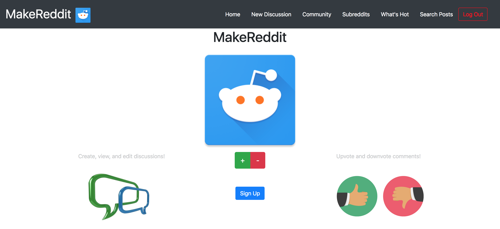

# MakeReddit

MakeReddit is a clone of reddit created during Make School. 

Some features it includes are:
    
    * Login / Logout features
    * Create new subreddits or chat rooms
    * Add posts inside subreddits
    * Comment on posts
    * Upvote and Downvote different posts
    * View the most popular posts
    * Search for keywords in posts
    * Browse the username database from the website
    * Edit current subreddits and subjects

